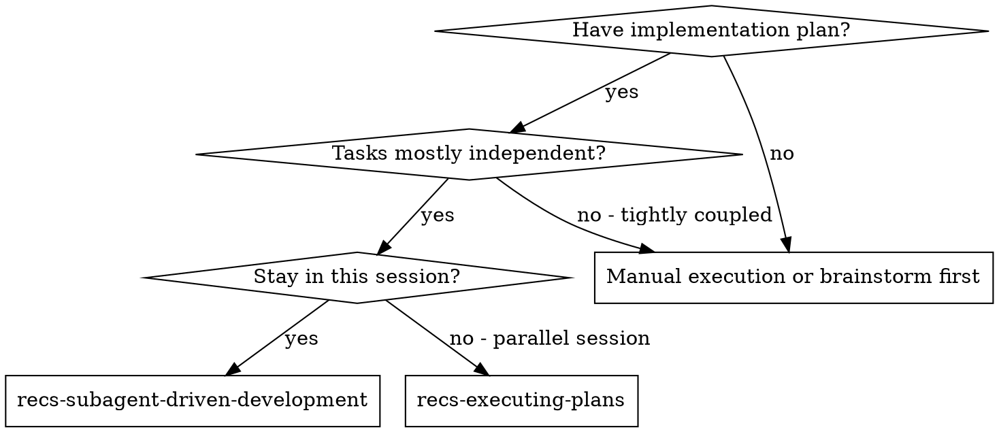
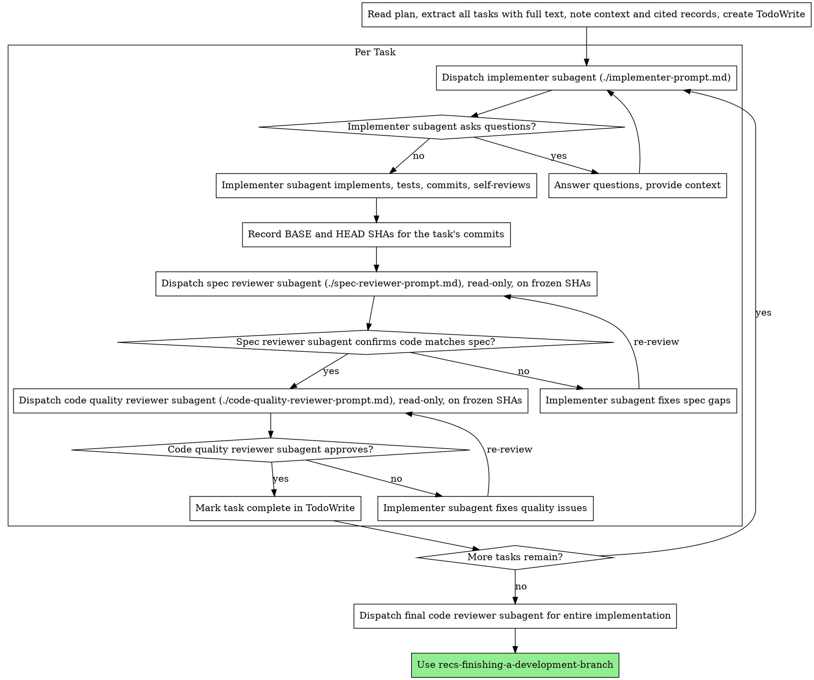

# Subagent-Driven Development

Execute plan by dispatching fresh subagent per task, with two-stage review after each: spec compliance review first, then code quality review.

**Core principle:** Fresh subagent per task + two-stage review (spec then quality) = high quality, fast iteration

In a project that keeps records as source of truth, "the spec" for a task is the task text **and the records it cites** — the user workflows, architectural decisions, features, ubiquitous language, and any catalog of exact user-facing text. Read the project's AGENTS.md and its records to know which exist here. Records change only at the user's direction; no subagent modifies one.

## When to Use



**vs. Executing Plans (parallel session):**
- Same session (no context switch)
- Fresh subagent per task (no context pollution)
- Two-stage review after each task: spec compliance first, then code quality
- Faster iteration (no human-in-loop between tasks)

## The Process



## Prompt Templates

- `./implementer-prompt.md` - Dispatch implementer subagent
- `./spec-reviewer-prompt.md` - Dispatch spec compliance reviewer subagent
- `./code-quality-reviewer-prompt.md` - Dispatch code quality reviewer subagent

## One writer per worktree

A git worktree has ONE shared index. Only one agent at a time may run `git add` or `git commit` in it — two agents touching disjoint files are still unsafe, because one agent's `git add` lands inside the other's commit. This is a fact about git, not a preference, and it is the reason implementation subagents are never dispatched in parallel.

Reviewers do not compete for the index, because reviewers are **read-only**:

- Tell every reviewer explicitly, in its prompt, that it is read-only.
- Give it the frozen SHAs it reviews: it reads with `git show <sha>:<path>` and `git diff <base>..<head>` — never the working tree, and never `git add`/`git commit`.
- A frozen SHA cannot change under the reviewer, so a writer can keep working while it reads.

## Speak the project's language

A project that keeps a ubiquitous language owns its words (check AGENTS.md and the records).

- One word per concept, and always the project's word. Never rotate synonyms for variety — if the project says "interlock," it is never "gate," "threshold," or "guard."
- Never write a new term into any file — a record, a plan, a comment, code, a test name, a commit message — before the user has agreed to that specific word. Propose candidates, wait, then sweep the agreed word everywhere in one pass.
- Where a word seems missing, first combine terms the project already owns (an "order" that needs checking gets an "order validator," not a "checker") before proposing a new one.

## Example Workflow

```
You: I'm using Subagent-Driven Development to execute this plan.

[Read plan file once: docs/plans/feature-plan.md]
[Extract all 5 tasks with full text, context, and the records each cites]
[Create TodoWrite with all tasks]

Task 1: Hook installation script

[Get Task 1 text, context, and cited records (already extracted)]
[Dispatch implementation subagent with full task text + context]

Implementer: "Before I begin - should the hook be installed at user or system level?"

You: "User level (~/.config/hooks/)"

Implementer: "Got it. Implementing now..."
[Later] Implementer:
  - Implemented install-hook command
  - Added tests, 5/5 passing
  - Self-review: Found I missed --force flag, added it
  - Committed

[Record BASE/HEAD SHAs, dispatch spec compliance reviewer (read-only, frozen SHAs)]
Spec reviewer: ✅ Spec compliant - all requirements met, records honored, nothing extra

[Dispatch code quality reviewer (read-only, same frozen SHAs)]
Code reviewer: Strengths: Good test coverage, clean. Issues: None. Approved.

[Mark Task 1 complete]

Task 2: Recovery modes

[Get Task 2 text, context, and cited records (already extracted)]
[Dispatch implementation subagent with full task text + context]

Implementer: [No questions, proceeds]
Implementer:
  - Added verify/repair modes
  - 8/8 tests passing
  - Self-review: All good
  - Committed

[Record BASE/HEAD SHAs, dispatch spec compliance reviewer (read-only, frozen SHAs)]
Spec reviewer: ❌ Issues:
  - Missing: Progress reporting (spec says "report every 100 items")
  - Drift: refusal text differs from the record the task cites (test asserts a paraphrase)
  - Extra: Added --json flag (not requested)

[Implementer fixes issues]
Implementer: Removed --json flag, added progress reporting, matched refusal text to the record character-for-character

[Spec reviewer reviews again, on the new HEAD SHA]
Spec reviewer: ✅ Spec compliant now

[Dispatch code quality reviewer (read-only, frozen SHAs)]
Code reviewer: Strengths: Solid. Issues (Important): Magic number (100)

[Implementer fixes]
Implementer: Extracted PROGRESS_INTERVAL constant

[Code reviewer reviews again]
Code reviewer: ✅ Approved

[Mark Task 2 complete]

...

[After all tasks]
[Dispatch final code-reviewer]
Final reviewer: All requirements met, ready to merge

Done!
```

## Advantages

**vs. Manual execution:**
- Subagents follow TDD naturally
- Fresh context per task (no confusion)
- Serialized writers, parallel-safe readers (one index, many frozen SHAs)
- Subagent can ask questions (before AND during work)

**vs. Executing Plans:**
- Same session (no handoff)
- Continuous progress (no waiting)
- Review checkpoints automatic

**Efficiency gains:**
- No file reading overhead (controller provides full text)
- Controller curates exactly what context is needed — including the records the task cites
- Subagent gets complete information upfront
- Questions surfaced before work begins (not after)

**Quality gates:**
- Self-review catches issues before handoff
- Two-stage review: spec compliance, then code quality
- Review loops ensure fixes actually work
- Spec compliance prevents over/under-building — and drift from the records
- Code quality ensures implementation is well-built

**Cost:**
- More subagent invocations (implementer + 2 reviewers per task)
- Controller does more prep work (extracting all tasks upfront)
- Review loops add iterations
- But catches issues early (cheaper than debugging later)

## Red Flags

**Never:**
- Skip reviews (spec compliance OR code quality)
- Proceed with unfixed issues
- Dispatch multiple implementation subagents in parallel — a worktree has one shared index, so one agent's `git add` lands inside the other's commit even when their files are disjoint
- Let a reviewer touch the working tree or the index — reviewers are read-only, on frozen SHAs, and their prompt says so
- Make subagent read plan file (provide full text instead)
- Skip scene-setting context (subagent needs to understand where task fits)
- Withhold the records a task cites (the subagent cannot match text it has never seen)
- Ignore subagent questions (answer before letting them proceed)
- Accept "close enough" on spec compliance (spec reviewer found issues = not done)
- Accept "close enough" on cataloged text (character-for-character or it is drift)
- Skip review loops (reviewer found issues = implementer fixes = review again)
- Let implementer self-review replace actual review (both are needed)
- **Start code quality review before spec compliance is ✅** (wrong order)
- Move to next task while either review has open issues
- Let any subagent modify a record — records change only at the user's direction

**If subagent asks questions:**
- Answer clearly and completely
- Provide additional context if needed
- Don't rush them into implementation

**If reviewer finds issues:**
- Implementer (same subagent) fixes them
- Reviewer reviews again, against the new HEAD SHA
- Repeat until approved
- Don't skip the re-review

**If subagent fails task:**
- Dispatch fix subagent with specific instructions
- Don't try to fix manually (context pollution)

## Integration

**Required workflow skills:**
- **recs-writing-plans** - Creates the plan this skill executes
- **recs-requesting-code-review** - Code review template for reviewer subagents
- **recs-finishing-a-development-branch** - Complete development after all tasks

**Subagents should use:**
- **recs-test-driven-development** - Subagents follow TDD for each task

**Alternative workflow:**
- **recs-executing-plans** - Use for parallel session instead of same-session execution
