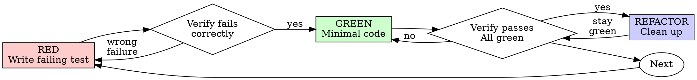

# Test-Driven Development (TDD)

## Overview

Write the test first. Watch it fail. Write minimal code to pass.

**Core principle:** If you didn't watch the test fail, you don't know if it tests the right thing.

**Violating the letter of the rules is violating the spirit of the rules.**

In a project that keeps records as source of truth — such as user workflows, architectural decisions, features, a ubiquitous language, or a message catalog holding the exact text the system gives when it refuses something or fails — the records sit upstream of the tests, and the tests sit upstream of the code. Check the project's AGENTS.md and its records before writing either.

## When to Use

**Always:**
- New features
- Bug fixes
- Refactoring
- Behavior changes

**Exceptions (ask your human partner):**
- Throwaway prototypes
- Generated code
- Configuration files

Thinking "skip TDD just this once"? Stop. That's rationalization.

## The Iron Law

```
NO PRODUCTION CODE WITHOUT A FAILING TEST FIRST
```

Write code before the test? Delete it. Start over.

**No exceptions:**
- Don't keep it as "reference"
- Don't "adapt" it while writing tests
- Don't look at it
- Delete means delete

Implement fresh from tests. Period.

## The Record Is the Red Phase

Where the project catalogs exact user-facing text — error messages, refusal text, validation failures — the catalog is the source and the tests assert it. A change to that text happens in the RECORD first, at the user's direction, and the failing test asserts the record's exact current text, character for character.

This extends the Iron Law:

```
NO PRODUCTION CODE WITHOUT A FAILING TEST FIRST
NO FAILING TEST ABOUT CATALOGED TEXT WITHOUT THE RECORD IT ASSERTS
```

Records change only at the user's direction. You do not "improve" a cataloged message in code and reconcile the record afterward — that inverts the whole chain. Wording changes in the record, then the test goes red against the new wording, then minimal code makes it pass. (Changing the record itself is its own discipline: see recs-writing-records.)

**No exceptions:**
- Don't tweak the message in code "and sync the catalog later"
- Don't assert a paraphrase — the record's exact text or nothing
- Don't invent refusal text the catalog doesn't hold; propose the entry first

**Worked example.** An invented order system keeps a message catalog; entry MSG-4 covers a refund requested after the return window. The user agrees the wording should change:

1. **Record:** MSG-4 gains its agreed wording — `The return window has closed; this order is not refundable.`
2. **RED:** The test asserting that exact string now fails — code still emits the old text:
   ```
   FAIL: expected 'The return window has closed; this order is not refundable.',
         got 'Refund window expired'
   ```
3. **GREEN:** Minimal code change emits the record's text. Nothing else moves.

The record led, the test followed, the code followed the test.

## Speak the project's language

A project that keeps a ubiquitous language owns its words (check AGENTS.md and the records).

- One word per concept, and always the project's word. Never rotate synonyms for variety — if the project says "interlock," it is never "gate," "threshold," or "guard."
- Never write a new term into any file — a record, a plan, a comment, code, a test name, a commit message — before the user has agreed to that specific word. Propose candidates, wait, then sweep the agreed word everywhere in one pass.
- Where a word seems missing, first combine terms the project already owns (an "order" that needs checking gets an "order validator," not a "checker") before proposing a new one.

## Red-Green-Refactor



### RED - Write Failing Test

Write one minimal test showing what should happen.

<Good>
```typescript
test('retries failed operations 3 times', async () => {
  let attempts = 0;
  const operation = () => {
    attempts++;
    if (attempts < 3) throw new Error('fail');
    return 'success';
  };

  const result = await retryOperation(operation);

  expect(result).toBe('success');
  expect(attempts).toBe(3);
});
```
Clear name, tests real behavior, one thing
</Good>

<Bad>
```typescript
test('retry works', async () => {
  const mock = jest.fn()
    .mockRejectedValueOnce(new Error())
    .mockRejectedValueOnce(new Error())
    .mockResolvedValueOnce('success');
  await retryOperation(mock);
  expect(mock).toHaveBeenCalledTimes(3);
});
```
Vague name, tests mock not code
</Bad>

The discipline is ecosystem-plural. The same RED in Racket, with rackunit — an invented refund calculation:

```racket
(test-case "refunds the full price inside the return window"
  (check-equal? (refund-amount 100 #:days-since-purchase 3) 100))
```

**Requirements:**
- One behavior
- Clear name: describes system behavior ("rejects an empty email"), never implementation, and never a record number alone
- Where the test exists to hold a record's promise, the record id goes in parens at the end: "rejects an empty email (MSG-3)", "refunds the full price inside the return window (MSG-4)"
- Real code (no mocks unless unavoidable)

### Verify RED - Watch It Fail

**MANDATORY. Never skip.**

```bash
npm test path/to/test.test.ts
# or, in Racket:
raco test refund-test.rkt
```

Confirm:
- Test fails (not errors)
- Failure message is expected
- Fails because feature missing (not typos)
- For cataloged text: fails because code lags the record's current wording, and the expected string in the failure output is the record's, verbatim

**Test passes?** You're testing existing behavior. Fix test.

**Test errors?** Fix error, re-run until it fails correctly.

### GREEN - Minimal Code

Write simplest code to pass the test.

<Good>
```typescript
async function retryOperation<T>(fn: () => Promise<T>): Promise<T> {
  for (let i = 0; i < 3; i++) {
    try {
      return await fn();
    } catch (e) {
      if (i === 2) throw e;
    }
  }
  throw new Error('unreachable');
}
```
Just enough to pass
</Good>

<Bad>
```typescript
async function retryOperation<T>(
  fn: () => Promise<T>,
  options?: {
    maxRetries?: number;
    backoff?: 'linear' | 'exponential';
    onRetry?: (attempt: number) => void;
  }
): Promise<T> {
  // YAGNI
}
```
Over-engineered
</Bad>

And the GREEN for the Racket RED above — just enough to pass, nothing about windows yet because no test demands it:

```racket
(define (refund-amount price #:days-since-purchase days)
  price)
```

Don't add features, refactor other code, or "improve" beyond the test.

### Verify GREEN - Watch It Pass

**MANDATORY.**

```bash
npm test path/to/test.test.ts
```

Confirm:
- Test passes
- Other tests still pass
- Output pristine (no errors, warnings)

**Test fails?** Fix code, not test.

**Other tests fail?** Fix now.

### REFACTOR - Clean Up

After green only:
- Remove duplication
- Improve names
- Extract helpers

Keep tests green. Don't add behavior.

### Repeat

Next failing test for next feature.

## Good Tests

| Quality | Good | Bad |
|---------|------|-----|
| **Minimal** | One thing. "and" in name? Split it. | `test('validates email and domain and whitespace')` |
| **Clear** | Name describes system behavior: "rejects an empty email" | `test('test1')`, `test('checkEmailImpl')` |
| **Cites its record** | Record id in parens at the end, where the test holds a record's promise: "rejects an empty email (MSG-3)", "refunds the full price inside the return window (MSG-4)" | A record number as the whole name: `test('MSG-3')` — the behavior vanished |
| **Shows intent** | Demonstrates desired API | Obscures what code should do |

Section-header comments inside a test file may cite the records or workflow steps the file walks — a comment names the record, the test names the behavior.

## Why Order Matters

**"I'll write tests after to verify it works"**

Tests written after code pass immediately. Passing immediately proves nothing:
- Might test wrong thing
- Might test implementation, not behavior
- Might miss edge cases you forgot
- You never saw it catch the bug

Test-first forces you to see the test fail, proving it actually tests something.

**"I already manually tested all the edge cases"**

Manual testing is ad-hoc. You think you tested everything but:
- No record of what you tested
- Can't re-run when code changes
- Easy to forget cases under pressure
- "It worked when I tried it" ≠ comprehensive

Automated tests are systematic. They run the same way every time.

**"Deleting X hours of work is wasteful"**

Sunk cost fallacy. The time is already gone. Your choice now:
- Delete and rewrite with TDD (X more hours, high confidence)
- Keep it and add tests after (30 min, low confidence, likely bugs)

The "waste" is keeping code you can't trust. Working code without real tests is technical debt.

**"TDD is dogmatic, being pragmatic means adapting"**

TDD IS pragmatic:
- Finds bugs before commit (faster than debugging after)
- Prevents regressions (tests catch breaks immediately)
- Documents behavior (tests show how to use code)
- Enables refactoring (change freely, tests catch breaks)

"Pragmatic" shortcuts = debugging in production = slower.

**"Tests after achieve the same goals - it's spirit not ritual"**

No. Tests-after answer "What does this do?" Tests-first answer "What should this do?"

Tests-after are biased by your implementation. You test what you built, not what's required. You verify remembered edge cases, not discovered ones.

Tests-first force edge case discovery before implementing. Tests-after verify you remembered everything (you didn't).

30 minutes of tests after ≠ TDD. You get coverage, lose proof tests work.

## Common Rationalizations

| Excuse | Reality |
|--------|---------|
| "Too simple to test" | Simple code breaks. Test takes 30 seconds. |
| "I'll test after" | Tests passing immediately prove nothing. |
| "Tests after achieve same goals" | Tests-after = "what does this do?" Tests-first = "what should this do?" |
| "Already manually tested" | Ad-hoc ≠ systematic. No record, can't re-run. |
| "Deleting X hours is wasteful" | Sunk cost fallacy. Keeping unverified code is technical debt. |
| "Keep as reference, write tests first" | You'll adapt it. That's testing after. Delete means delete. |
| "Need to explore first" | Fine. Throw away exploration, start with TDD. |
| "Test hard = design unclear" | Listen to test. Hard to test = hard to use. |
| "TDD will slow me down" | TDD faster than debugging. Pragmatic = test-first. |
| "Manual test faster" | Manual doesn't prove edge cases. You'll re-test every change. |
| "Existing code has no tests" | You're improving it. Add tests for existing code. |
| "I'll fix the message text in code and update the record later" | The record is the source; tests assert it; code follows. |

## Red Flags - STOP and Start Over

- Code before test
- Test after implementation
- Test passes immediately
- Can't explain why test failed
- Tests added "later"
- Cataloged text changed in code first, record "to be synced"
- A test asserting a paraphrase of a record's text
- Rationalizing "just this once"
- "I already manually tested it"
- "Tests after achieve the same purpose"
- "It's about spirit not ritual"
- "Keep as reference" or "adapt existing code"
- "Already spent X hours, deleting is wasteful"
- "TDD is dogmatic, I'm being pragmatic"
- "This is different because..."

**All of these mean: Delete code. Start over with TDD.**

## Example: Bug Fix

**Bug:** Empty email accepted

**RED**
```typescript
test('rejects an empty email (MSG-3)', async () => {
  const result = await submitForm({ email: '' });
  expect(result.error).toBe('Email required');
});
```
(The string is the catalog's, verbatim — MSG-3 here is an invented message catalog's entry holding exactly `Email required`.)

**Verify RED**
```bash
$ npm test
FAIL: expected 'Email required', got undefined
```

**GREEN**
```typescript
function submitForm(data: FormData) {
  if (!data.email?.trim()) {
    return { error: 'Email required' };
  }
  // ...
}
```

**Verify GREEN**
```bash
$ npm test
PASS
```

**REFACTOR**
Extract validation for multiple fields if needed.

## Verification Checklist

Before marking work complete (see recs-verification-before-completion):

- [ ] Every new function/method has a test
- [ ] Watched each test fail before implementing
- [ ] Each test failed for expected reason (feature missing, not typo)
- [ ] Wrote minimal code to pass each test
- [ ] All tests pass
- [ ] Output pristine (no errors, warnings)
- [ ] Tests use real code (mocks only if unavoidable)
- [ ] Edge cases and errors covered
- [ ] Every asserted user-facing string matches its record's current text exactly
- [ ] No new term appears in code, tests, or comments that the user has not agreed to
- [ ] Every comment obeys the project's comment rule, and each sentence is true of the code as committed
- [ ] No comment says what a later task will do, or what used to be true — those belong to the plan and to the commit

Can't check all boxes? You skipped TDD. Start over.

## When Stuck

| Problem | Solution |
|---------|----------|
| Don't know how to test | Write wished-for API. Write assertion first. Ask your human partner. |
| Test too complicated | Design too complicated. Simplify interface. |
| Must mock everything | Code too coupled. Use dependency injection. |
| Test setup huge | Extract helpers. Still complex? Simplify design. |
| Record and code disagree on wording | The record wins. If the record itself seems wrong, that's the user's call — propose, wait (recs-writing-records). |

## Debugging Integration

Bug found? Write failing test reproducing it. Follow TDD cycle. Test proves fix and prevents regression. For finding the root cause first, use recs-systematic-debugging.

Never fix bugs without a test.

## Testing Anti-Patterns

When adding mocks or test utilities, read @testing-anti-patterns.md to avoid common pitfalls:
- Testing mock behavior instead of real behavior
- Adding test-only methods to production classes
- Mocking without understanding dependencies

## Final Rule

```
Production code → test exists and failed first
Cataloged text → the record changed first, and the test asserts it
Otherwise → not TDD
```

No exceptions without your human partner's permission.
